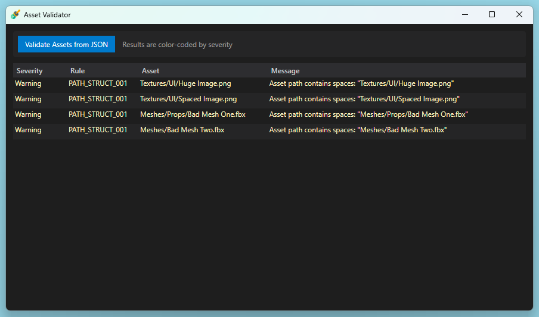

# Asset Validator

**Asset Validator** is a lightweight, engine-agnostic validation tool for game development pipelines.

It validates **asset metadata exported to JSON**, using a shared rule engine that can run in CI via a CLI or locally through a desktop UI.

The goal is to catch common content issues **early**, without requiring the game engine to be running.

---

## Why This Exists

In real projects, asset problems are often discovered too late:
- builds fail unexpectedly
- performance issues creep in
- QA finds avoidable content errors

Asset Validator moves these checks earlier in the pipeline by validating exported **metadata**, making validation deterministic, testable, and automation-friendly.

---

## How It Works

```
Engine / DCC (metadata export) → JSON → Asset Validator
                                      → CLI (CI / automation)
                                      → UI  (local inspection)
```

The validator operates purely on serialized metadata and has no dependency on any specific engine.

---

## Validation Results (UI)



The desktop UI presents validation results in a tabular form, grouped by severity.
This allows quick inspection of asset issues without digging through logs or raw JSON output.

---

## Releases

Prebuilt binaries for the **CLI** and **desktop UI** are available on the GitHub **Releases** page.

Releases are intended for:
- local inspection of validation results (UI)
- CI and automation workflows (CLI)

---

## Repository Structure

- **AssetValidator.Core**  
  Validation rules and core domain logic.

- **AssetValidator.Cli**  
  Command-line interface for CI and automation.

- **AssetValidator.Ui**  
  Desktop application for inspecting validation results.

- **AssetValidator.Core.Tests**  
  Unit tests for rules and core behavior.

---

## CLI Usage

Run validation:
```
AssetValidator.Cli --input examples/assets_valid.json
```

Output results as JSON (for CI or tooling):
```
AssetValidator.Cli --input examples/assets_valid.json --json-results
```

### Exit Codes

| Code | Meaning |
| ---- | ------- |
| 0 | Validation passed |
| 1 | Validation errors found |
| 2 | Tool failure (IO / parsing error) |

---

## Examples

The `examples/` directory contains sample metadata exports:

- `assets_valid.json` – all assets pass validation  
- `assets_invalid.json` – validation completes with errors  
- `assets_malformed.json` – invalid input file  

---

## Integrations

Each supported tool provides a small editor-side exporter responsible only for extracting asset **metadata** and exporting it to JSON.  

### Unreal Engine Integration

Unreal support is provided via a standalone editor plugin:  
https://github.com/janikowski-dev/Unreal-Metadata-Exporter

### Blender Integration

Blender support is provided via a standalone editor add-on:  
https://github.com/janikowski-dev/Blender-Metadata-Exporter

---

## Design Goals

- Engine-agnostic validation  
- Metadata-driven, deterministic rules  
- CI-friendly CLI interface  
- Clear separation between export and validation  

---

## Scope

This repository contains only the validation engine and tooling.

Engine-specific exporters and editor integrations are intentionally kept separate to keep the core portable and reusable.
